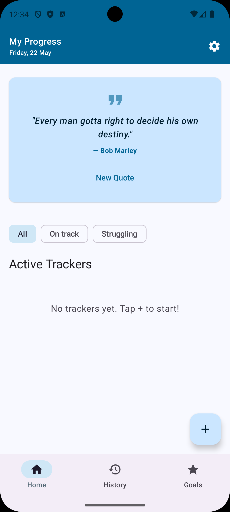
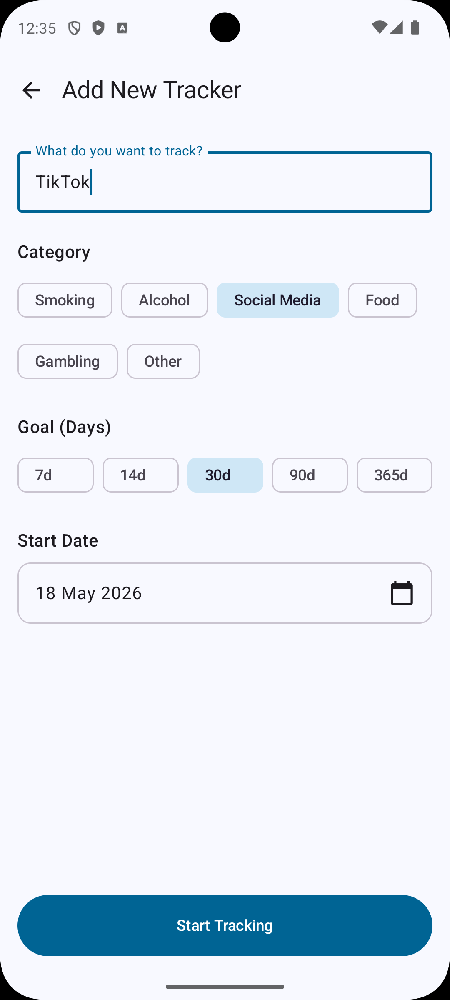
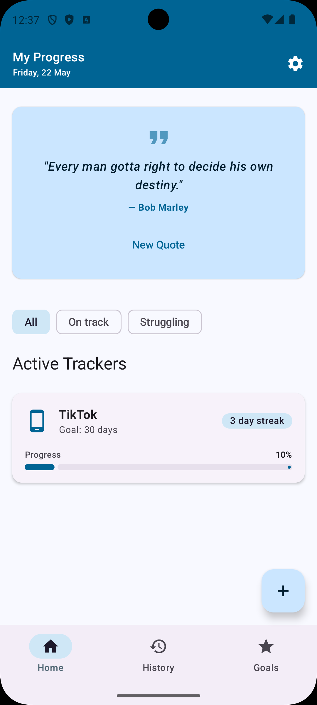
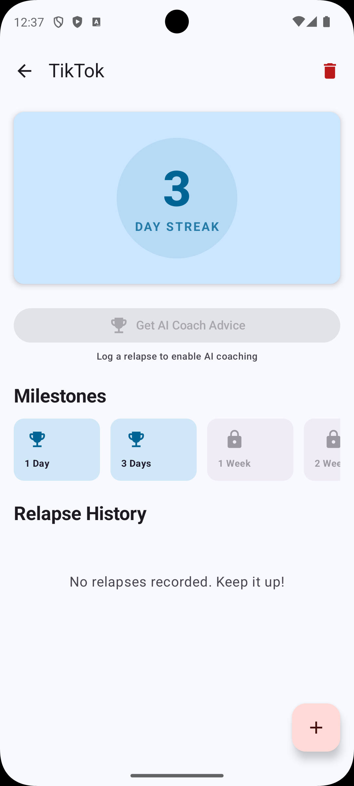
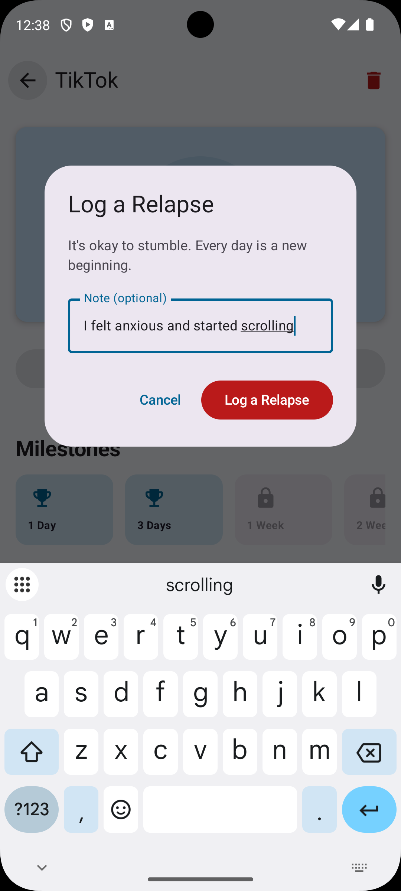
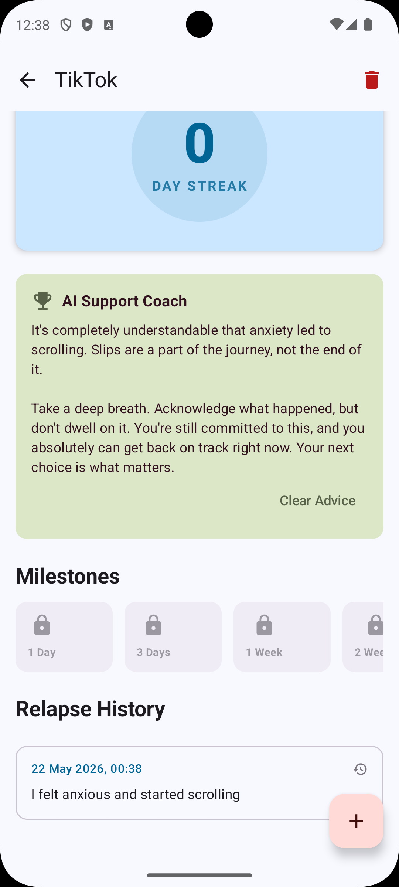
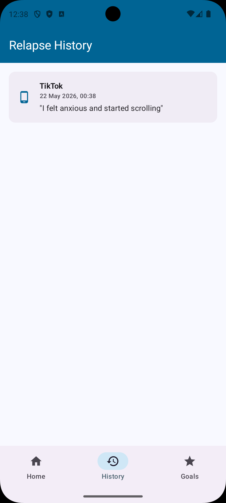
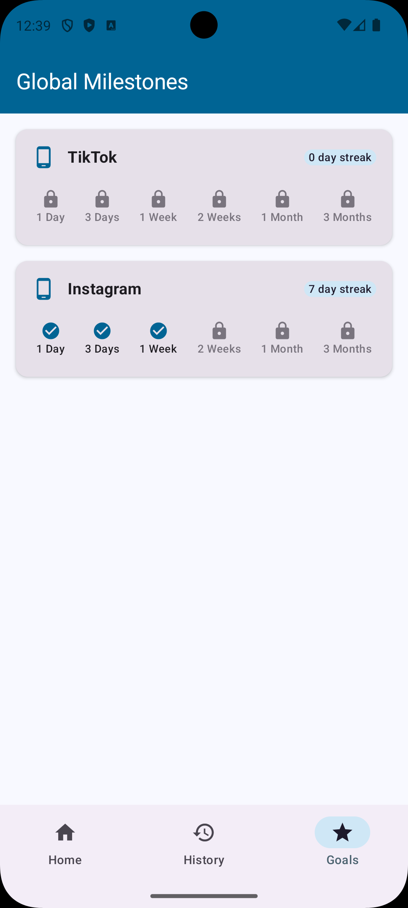
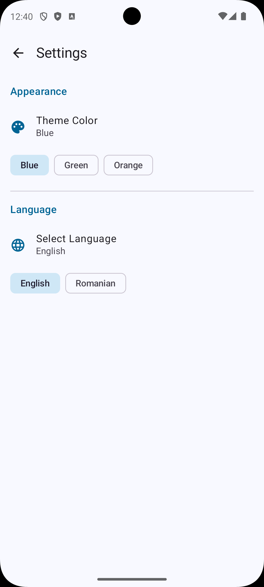
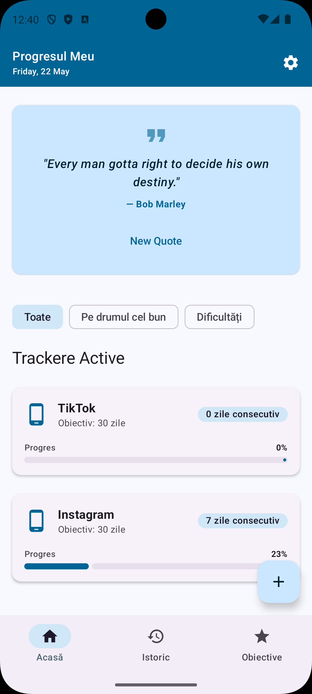

# 🛡️ The Addiction Tracker app - Recovery & Progress Tracker

The Addiction Tracker app is a modern, high-performance Android application designed to help users track their journey toward overcoming addictions. 
It combines evidence-based tracking (streaks and milestones) with cutting-edge AI support to provide a personal recovery coach in your pocket.

---

## 🚀 Features

### 1. **Dynamic Progress Dashboard**
* **Live Streaks:** Automatically calculates days since your start date or most recent relapse.
* **Smart Filtering:** Categorize your trackers into "On Track" or "Struggling" to focus your energy where it matters most.
* **Daily Motivation:** Fetches real-time inspirational quotes via an online API (ZenQuotes).

### 2. **AI Support Coach 🤖**
* **Contextual Advice:** Uses the **Google Gemini API** to analyze your relapse notes and provide meaningful advice.
* **Personalized Encouragement:** Provides empathetic, unique advice tailored to specific triggers (e.g., stress, social pressure) instead of generic messages.

### 3. **Milestones & Achievements**
* **Rewarding Progress:** Global milestones (1 Day, 1 Week, 1 Month, etc.) are automatically unlocked based on your streak.
* **Visual Trophy Room:** A dedicated Goals screen to see all your accomplishments across different habits.

### 4. **Deep History Tracking**
* **Detailed Logs:** Keep track of every relapse with optional notes to identify patterns and triggers over time.

### 5. **Customizable Experience**
* **Multi-Theme Support:** Choose between **Tranquil Blue**, **Nature Green**, or **Sunset Orange** palettes.
* **Multi-Language** support (English, Romanian)
* **Localization:** Fully translated into **English** and **Romanian**.
* **Persistent Settings:** Your preferences are saved locally and remembered across app restarts.

---

## 🏗️ Architecture

The app follows the **Official Android Recommended Architecture** (MVVM + Repository Pattern), ensuring clean separation of concerns and high testability.

### Layers:
1.  **UI Layer (Jetpack Compose):** A modern UI that reacts instantly to state changes.
2.  **State Holders (ViewModel):** Managed by Hilt, these handle business logic and expose data via `StateFlow`.
3.  **Repository Layer:** Acts as a single source of truth, coordinating between the local database and remote APIs.
4.  **Data Layer:**
    *   **Local:** Room Database for persistent storage of addictions and relapses.
    *   **Remote:** Retrofit for Quotes API and Google AI SDK for Gemini.

### 🛠️ Tech Stack:
*   **Language:** Kotlin
*   **UI Toolkit:** Jetpack Compose
*   **Database:** Room DB
*   **DI:** Hilt (Dagger)
*   **Networking:** Retrofit & OkHttp
*   **Concurrency:** Kotlin Coroutines & Flow
*   **Navigation:** Jetpack Navigation

---

## 📸 Presentation Support

---
**Developed with ❤️ for a healthier lifestyle.**
